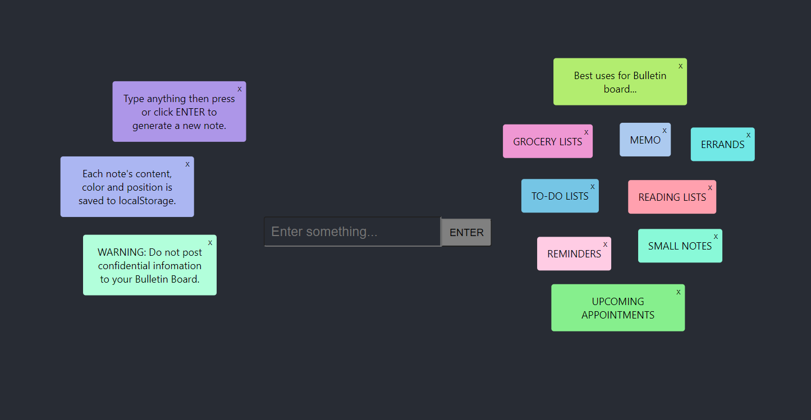
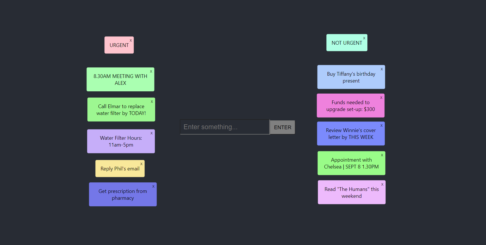

## Sticky Board

### Description

A simple app to write anything on the board. The notes will be saved to localStorage so don't write anything confidential or private on it. This app can do the following:

- Allows user to type something in an input and press ENTER to generate a note of a random colour.
- Allows user to drag the note anywhere. Its position, colour and content will be saved even after the user exits the app.
- Allows the user to delete the note by clicking on the top-right 'X' button.

Use it for:

- To-do lists
- Grocery lists
- Reading lists
- Brainstorming ideas
- Upcoming appointments
- Quote collection

And many more, be creative with it!

### Technologies Used

- [Create React App](https://github.com/facebook/create-react-app).
- [react-draggable](https://github.com/STRML/react-draggable/)
- [randomcolor](https://www.npmjs.com/package/randomcolor)
- [uuid](https://www.npmjs.com/package/uuid)
